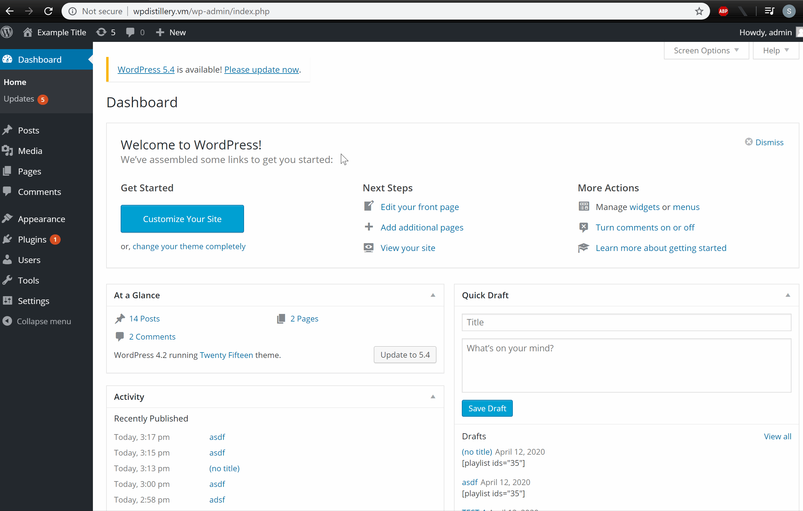
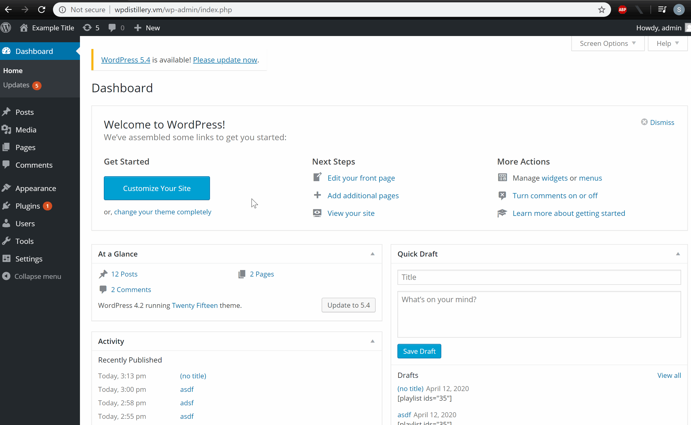
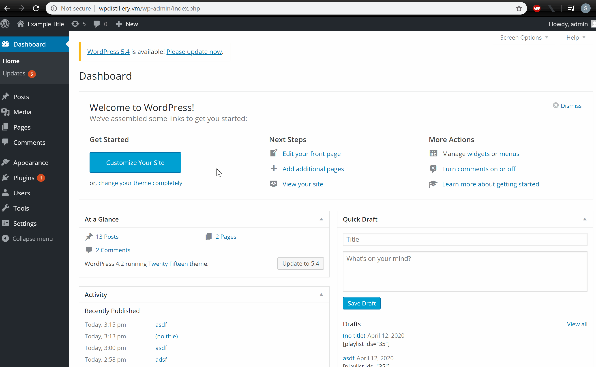

# Project 7 - WordPress Pentesting

Time spent: **6** hours spent in total

> Objective: Find, analyze, recreate, and document **five vulnerabilities** affecting an old version of WordPress

## Pentesting Report

1. (Required) Cross-Site Scripting (XSS)
  - [ ] Summary: The metadata in a music media file can be exploited by embedding a script in the description. The inserted script is executed when post is published with a music playlist containing the media file.
    - Vulnerability types: XSS
    - Tested in version: 4.2
    - Fixed in version: 4.2.13
  - [ ] GIF Walkthrough: 
    
  - [ ] Steps to recreate: 
    1. Log in as admin
    2. Add a music file with embedded script: Media > Add New > Select Files  The music file can be found [here](https://seclists.org/oss-sec/2017/q1/563)
    3. Create a new post with a playlist containing the file: Posts > Add New > Add Media > Create Audio Playlist > Select the music file
2. (Required) Cross-Site Scripting (XSS)
  - [ ] Summary: When a link is created in a new post, a script can be inserted within the html.
    - Vulnerability types: XSS
    - Tested in version: 4.2
    - Fixed in version: 4.2.3
  - [ ] GIF Walkthrough:
     
  - [ ] Steps to recreate: 
    1. Login as admin
    2. Create a new post with the following in the body: `<a href="[caption code=">]</a><a title=" onmouseover=alert('VULNERABLE!') ">link</a>`
  - [ ] Affected source code:
    - [Link 1](https://klikki.fi/adv/wordpress3.html)
3. (Required) Cross-Site Scripting (XSS)
  - [ ] Summary: When a youtube video is embedded in a new post, a script can be inserted at the end of the link.
    - Vulnerability types: XSS
    - Tested in version: 4.2
    - Fixed in version: 4.2.13
  - [ ] GIF Walkthrough: 
    
  - [ ] Steps to recreate: 
    1. Login as admin
    2. Create a new post with the following in the body: `[embed src='https://youtube.com/embed/12345\x3csvg onload=alert(12345)\x3e'][/embed]`

## Resources

- [WordPress Source Browser](https://core.trac.wordpress.org/browser/)
- [WordPress Developer Reference](https://developer.wordpress.org/reference/)

GIFs created with [ScreenToGif](https://www.screentogif.com/).

## License

    Licensed under the Apache License, Version 2.0 (the "License");
    you may not use this file except in compliance with the License.
    You may obtain a copy of the License at

        http://www.apache.org/licenses/LICENSE-2.0

    Unless required by applicable law or agreed to in writing, software
    distributed under the License is distributed on an "AS IS" BASIS,
    WITHOUT WARRANTIES OR CONDITIONS OF ANY KIND, either express or implied.
    See the License for the specific language governing permissions and
    limitations under the License.