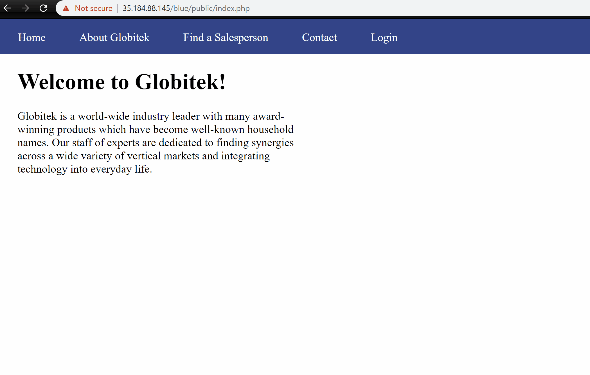
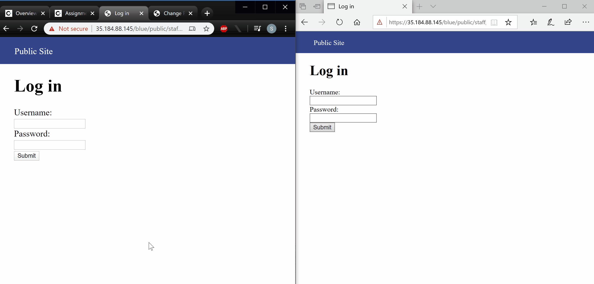
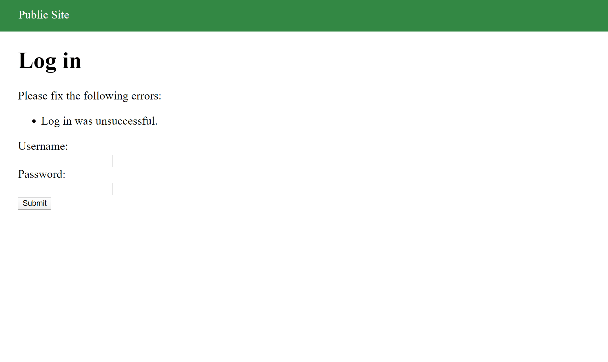
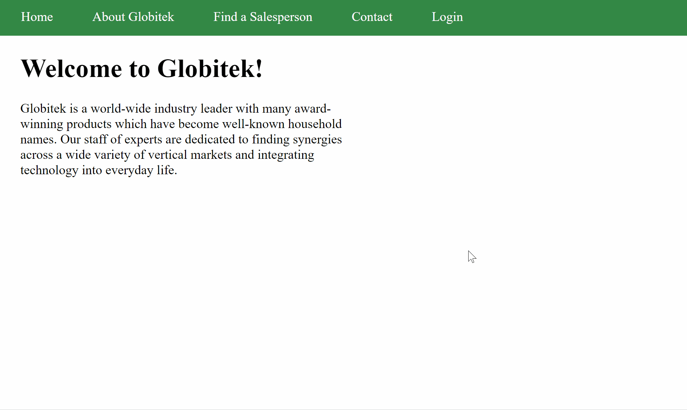
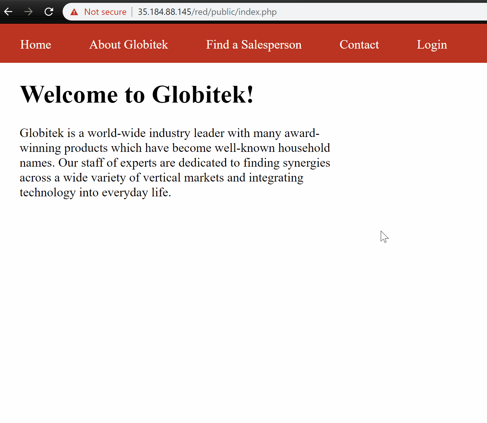
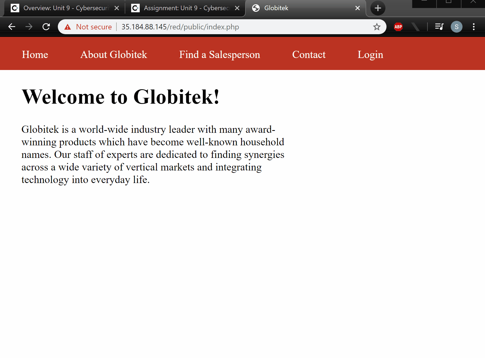

# Project 8 - Pentesting Live Targets

Time spent: **6** hours spent in total

> Objective: Identify vulnerabilities in three different versions of the Globitek website: blue, green, and red.

The six possible exploits are:
* Username Enumeration
* Insecure Direct Object Reference (IDOR)
* SQL Injection (SQLi)
* Cross-Site Scripting (XSS)
* Cross-Site Request Forgery (CSRF)
* Session Hijacking/Fixation

Each version of the site has been given two of the six vulnerabilities. (In other words, all six of the exploits should be assignable to one of the sites.)

## Blue

**Vulnerability #1: SQL Injection**

The value of the _id_ parameter in the Salesperson page is vulnerable to SQL injection. In the example below, the injected SQL pauses the server for 5 seconds before returning from the query.

**Vulnerability #2: Session Hijacking/Fixation**

A session that is generated in one browser can be reused in a second browser by setting the session ID of the second browser to that of the first. This authenticates the second user without having to provide any credentials.

## Green

**Vulnerability #1: Username Enumeration**

When a login attempt with an existing username fails, the error message that is displayed is shown in bold font. For logins that fail with usernames not registered in the database, the error message is shown in a non-bold font. This enables to user to enumerate the valid usernames using a bruteforce attack.

**Vulnerability #2: Cross-Site Scripting (XSS)**

The feedback form can be used to record a malicious script that is executed when an administrator views the inputted content. 

## Red

**Vulnerability #1: Insecure Direct Object Reference**

The `id` param in the URL of a salespersons profile page can be modified to access the profiles/objects of users that were not intended to be public.

**Vulnerability #2: Cross Site Request Forgery**

The feedback form is vulnerable to storing a malicious script file that can be used to insidiously submit a form when it is opened by an administrator. In the example below, the form that is submitted modifies the last name of the user with `id`=7 to _CCNY_.

## Notes

Describe any challenges encountered while doing the work
