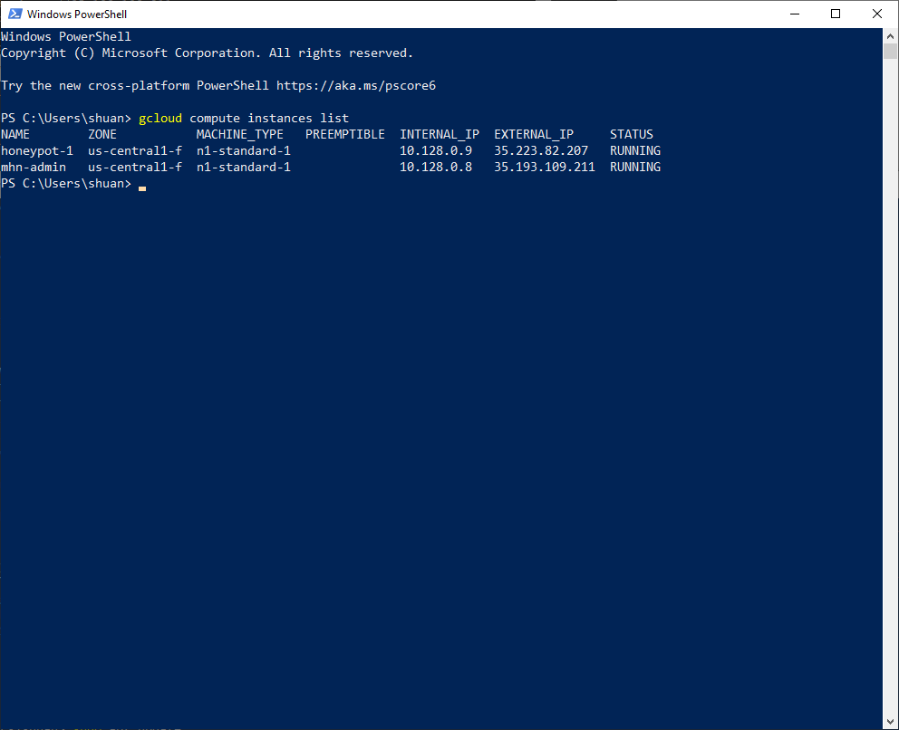
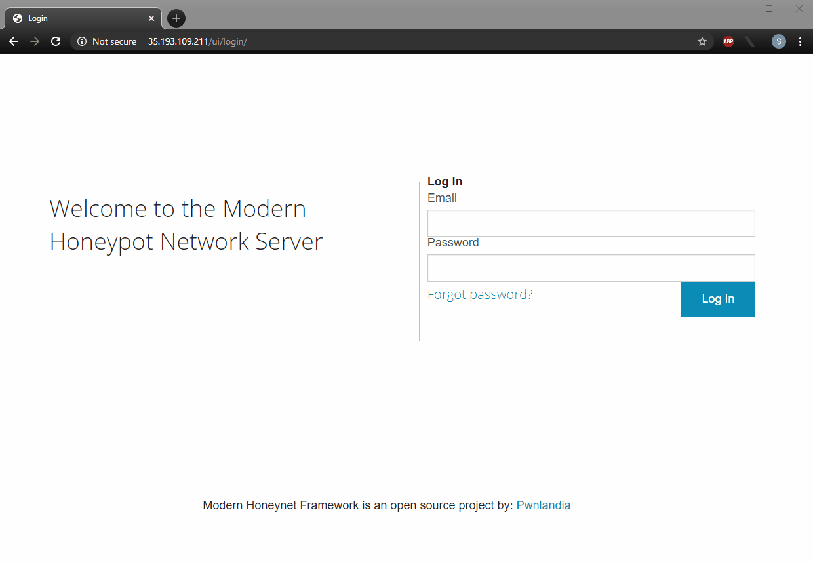
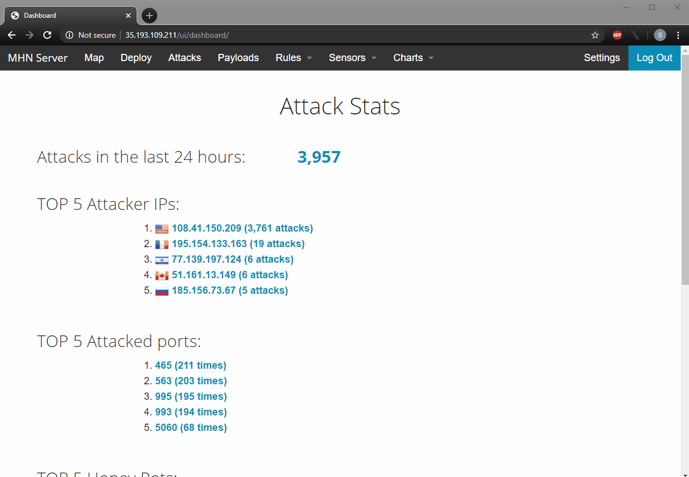

# Week 10 - 11: Honeypot

Time spent: **6** hours spent in total

## **Objective**
<blockquote>
In this assignment, you will stand up a basic honeypot and demonstrate its effectiveness at detecting and/or collecting data about an attack. Guided instructions for doing this using specific software are provided below, but you are free to take any approach you wish that demonstrates the following basic principles:Successful configuration and deployment of a network-accessible honeypot server with two primary features:

1. Successful configuration and deployment of a network-accessible honeypot server with two primary features:
    - An attack surface that is vulnerable or exposed in some way to network-based attacks
    - A network security feature such as an IDS configured to detect and log such attacks
2. Illustration of at least one attack against the honeypot that can be detected or logged in a way that captures information about the attack or the attacker
</blockquote>

##  **Setup & Configuration**
The honeypot requires setting up two virtual machines. One of the machines is used to deploy, manage, and collect information on the honeypot. The other VM hosts the honey pot. In this laboratory, machines _mhn-admin_ and _honeypot-1_ were created:

Below demonstrates logging into the admin console:

-   

Below shows the deployed honeypot in the Sensors page of the admin console.
-   

##  **Attack & Detection**
### **Honeypot deployed:** *Ubuntu/Raspberry Pi - Dionaea*
-   GIF sample of some attacks and collected data
    -   

-   [Log](nmap_attack_log.txt) of nmap attack
-   [Data dump](session.json) of data from honeypot
-   Number of attacks: *3923*